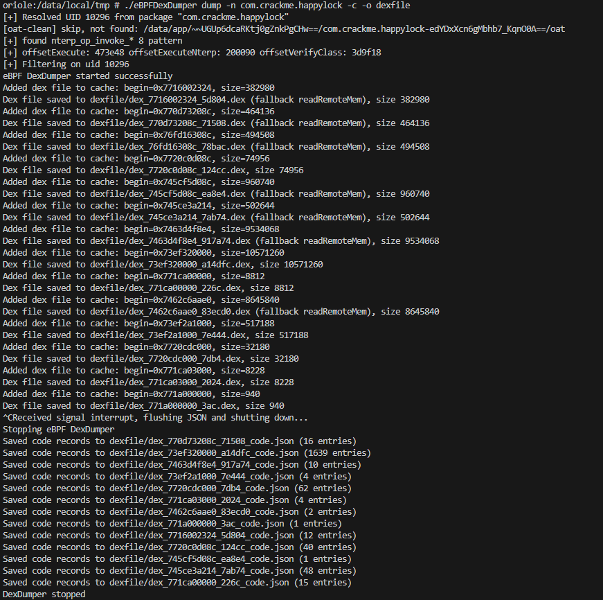
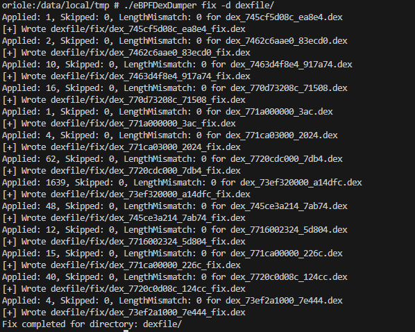
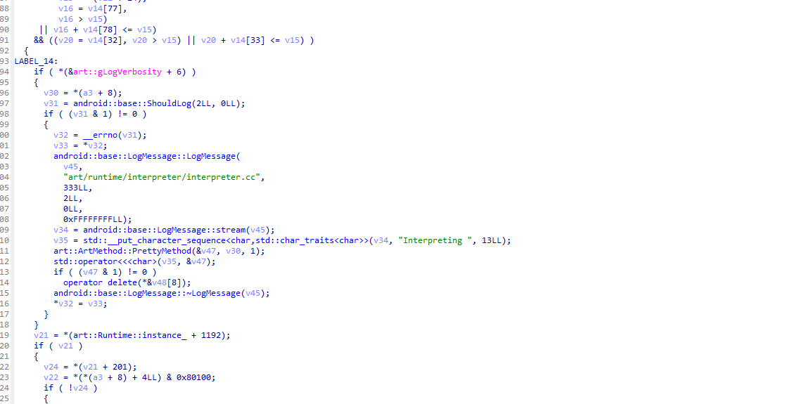
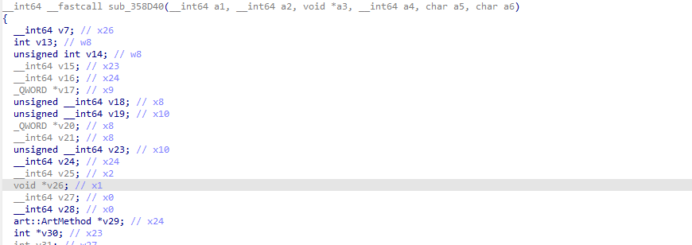

# eBPFDexDumper

[](https://golang.org/)
[](https://android.com/)

[中文](README.md) | [English](README_en.md)

基于 eBPF 技术的 Android 内存 DEX 转储工具。

## 特性
- **不可检测**: 使用 eBPF 探针进行隐蔽操作
- **被动转储**: 非侵入式内存分析
- **实时追踪**: 可选的方法执行监控
- **自动修复**: 内置 DEX 文件修复功能

**展示**: https://blog.lleavesg.top/article/eBPFDexDumper

## 支持环境
- **测试环境**: Android 13 (Pixel 6)
- **架构**: ARM64
- **要求**: 需要 Root 权限

**注意**: 在其他 Android 版本上可能需要微调并重新编译。

## 先决条件
在转储之前，建议删除应用的 OAT 优化输出以避免 `cdex` 或空结果。您可以手动执行此操作，或让工具使用 `--clean-oat` 自动删除：
- 查找基础路径: `pm path <package>`
- 删除 oat 文件夹: 删除 `/data/app/.../<package>/` 下的应用 `oat/` 目录

通常需要 Root 权限来附加探针和读取目标内存。

## 使用方法

### 命令语法
```
eBPFDexDumper [命令] [选项]
```

**可用命令:**
- `dump` - 启动基于 eBPF 的 DEX 转储器
- `fix` - 修复目录中的转储 DEX 文件

### `dump` 命令
将探针附加到 libart 并流式传输 DEX/方法事件。您必须提供 `--uid` 或 `--name` 之一来过滤目标应用。

**选项:**
- `--uid, -u <uid>` - 按 UID 过滤（`--name` 的替代方案）（默认值：0）
- `--name, -n <package>` - Android 包名以派生 UID（`--uid` 的替代方案）
- `--libart, -l <path>` - libart.so 路径（默认值：`/apex/com.android.art/lib64/libart.so`）
- `--out, -o, --output <dir>` - 设备上的输出目录（必需）
- `--trace, -t` - 在转储期间实时打印执行的方法（默认值：false）
- `--clean-oat, -c` - 在转储前删除目标应用的 `/data/app/.../oat` 文件夹（默认值：false）
- `--execute-offset <value>` - art::interpreter::Execute 函数的手动偏移量（十六进制值，例如 0x12345）(不指定参数会自动寻找) (在IDA中通过搜索字符串Interpreting 被哪些函数索引定位，见下文 - 高版本Android中libart.so去除符号后如何寻找正确的偏移)
- `--nterp-offset <value>` - ExecuteNterpImpl 函数的手动偏移量（十六进制值，例如 0x12345）(不指定参数会自动寻找) (默认字节码匹配，一般情况下会自动搜索到) 

**示例:**
```bash
# 按 UID 过滤
./eBPFDexDumper dump -u 10244 -o /data/local/tmp/out

# 按包名过滤（自动解析 UID）
./eBPFDexDumper dump -n com.example.app -o /data/local/tmp/out

# 启用实时方法追踪输出
./eBPFDexDumper dump -n com.example.app -o /data/local/tmp/out -t

# 自定义 libart 路径
./eBPFDexDumper dump -u 10244 -l /apex/com.android.art/lib64/libart.so -o /sdcard/dex_out

# 自动删除 oat 以提高完整性
./eBPFDexDumper dump -n com.example.app -o /data/local/tmp/out -c

# 为特定 ART 版本使用手动偏移量
./eBPFDexDumper dump -n com.example.app -o /data/local/tmp/out --execute-offset 0x12345 --nterp-offset 0x67890
```

**输出文件:**
- **DEX 文件**: `dex_<begin>_<size>.dex` 保存在输出目录下
- **方法字节码 JSON**: `dex_<begin>_<size>_code.json` 在关闭时保存（SIGINT/SIGTERM）或正常退出


### `fix` 命令
扫描目录中的转储 DEX 文件并修复头部/结构以提高可读性。

**选项:**
- `--dir, -d <dir>` - 包含转储 DEX 文件的目录（必需）

**示例:**
```bash
./eBPFDexDumper fix -d /data/local/tmp/out
```


## 安装与构建

### 要求
- **Go 1.19+** 用于构建应用程序
- **Android NDK** 用于交叉编译
- **Android 设备** 具有 ARM64 架构
- 目标 Android 设备上的 **Root 访问权限**

### 构建说明
1. **克隆仓库:**
   ```bash
   git clone https://github.com/LLeavesG/eBPFDexDumper.git
   cd eBPFDexDumper
   ```

2. **如有必要调整 NDK 路径**，然后构建:
   ```bash
   # pull btf file
   ./build_env.sh

   # build
   ./build.sh
   ```

3. **推送到 Android 设备:**
   ```bash
   adb push eBPFDexDumper /data/local/tmp/
   adb shell chmod +x /data/local/tmp/eBPFDexDumper
   ```

## 故障排除

### 高版本Android中libart.so去除符号后如何寻找函数正确的偏移
脱壳工具可以自己寻找NterpExecuteImpl函数的偏移，方法是通过字节码匹配实现
```
F0 0B 40 D1 1F 02 40 B9 FF 83 02 D1 E8 27 00 6D EA 2F 01 6D EC 37 02 6D EE 3F 03 6D F3 53 04 A9 F5 5B 05 A9 F7 63 06 A9 F9 6B 07 A9 FB 73 08 A9 FD 7B 09 A9 16 08 40 F9
```

而对于Execute函数，需要在IDA中打开libart.so，搜索字符串"Interpreting"，然后查看哪些函数引用了这个字符串，通常会有两个函数引用它，而其中一个函数的传入参数数量为6，那么这个函数就是我们要找的Execute函数



### 常见问题

**1.UID而非PID**
请勿使用-u指定应用程序pid，必须指定uid，或直接使用-n指定包名

**2. 找不到二进制文件**
```bash
# 验证文件是否正确推送
adb shell ls -la /data/local/tmp/eBPFDexDumper

# 确保执行权限
adb shell chmod +x /data/local/tmp/eBPFDexDumper
```

**3. 空或不完整的 DEX 文件**
- 使用 `--clean-oat` 标志删除 OAT 优化
- 确保目标应用正在运行
- 为您的特定 Android 版本尝试手动偏移值

**4. 找不到 libart.so**
```bash
# 在您的设备上查找 libart.so 位置
adb shell find /apex -name "libart.so" 2>/dev/null
adb shell find /system -name "libart.so" 2>/dev/null
```

## 参考资料
- [cilium/ebpf](https://github.com/cilium/ebpf) - Go 的 eBPF 库
- [ebpfmanager](https://github.com/gojue/ebpfmanager) - Go + eBPF管理库
- [stackplz](https://github.com/SeeFlowerX/stackplz) - StackPlz eBPF Tools
- [eDBG](https://github.com/ShinoLeah/eDBG) - eDBG eBPF Debugger
- [null-luo/btrace](https://github.com/null-luo/btrace) - 二进制追踪工具
- [ART 内部结构](https://evilpan.com/2021/12/26/art-internal/)
- [Android 运行时分析](https://zhuanlan.zhihu.com/p/523692715)
- [DEX 文件格式](https://blog.csdn.net/weixin_47668107/article/details/114251185)
- [Android 安全研究](https://juejin.cn/post/7045575502991458340)
- [Android 上的 eBPF](https://juejin.cn/post/7384992816906747913)
- [高级混淆技术](https://blog.quarkslab.com/dji-the-art-of-obfuscation.html)
- [eBPF 文档](https://blog.seeflower.dev/archives/84/#title-7)


## 贡献

欢迎贡献！请随时提交 Pull Request。


## 免责声明

此工具仅用于教育和防御性安全研究目的。用户有责任确保符合适用的法律法规。